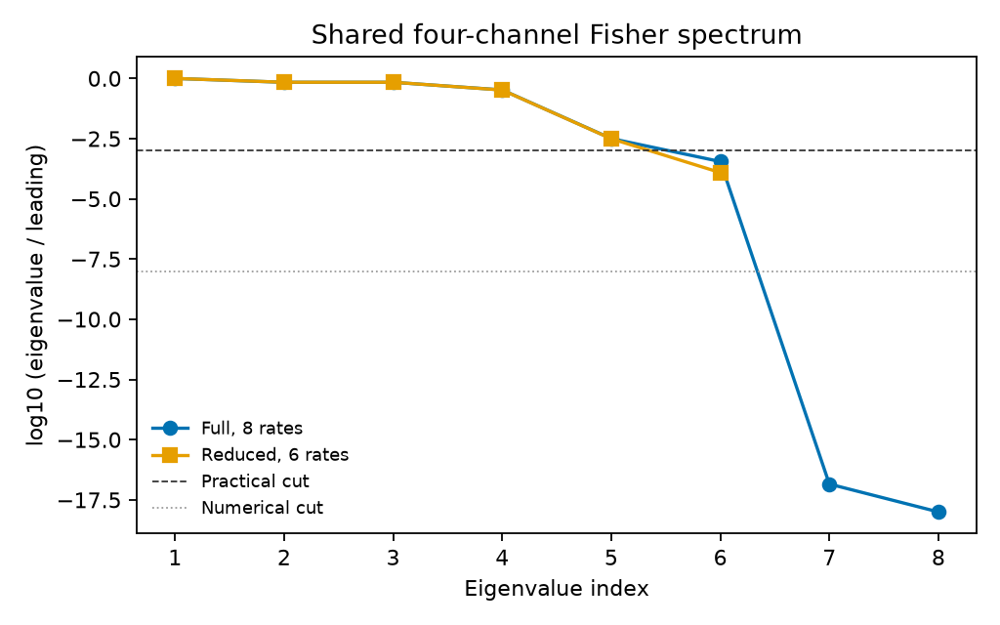
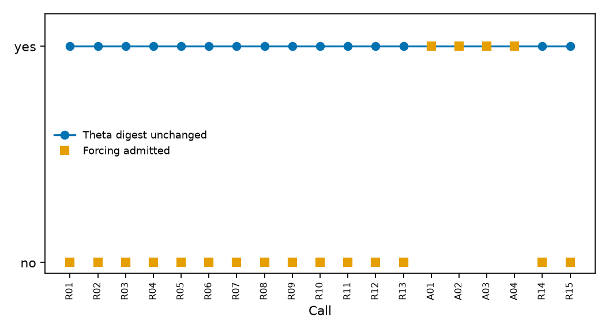
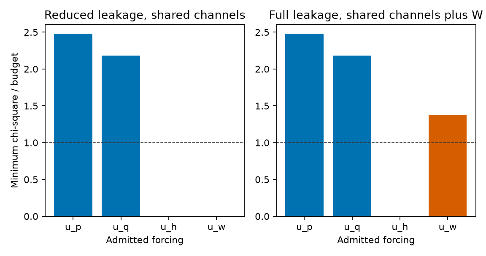
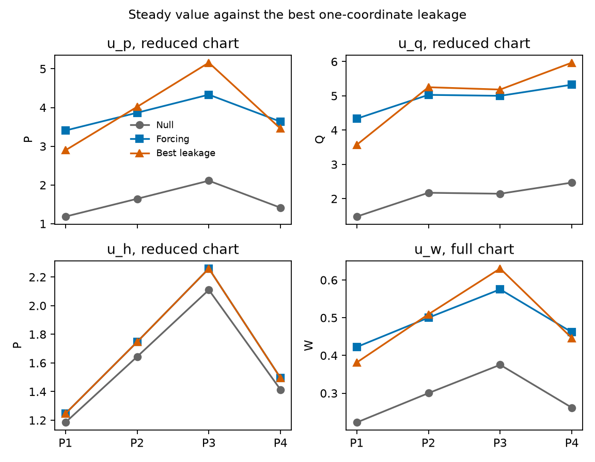

# Admitted known forcings that remain distinguishable after a stiff–sloppy reduction

**Thesis #28. Computational research thesis**  
**Depends on:** Thesis #19 (forcing admission under evidence gates) and Thesis #24 (reduction-preserving multi-channel identifiability)  
**Author:** Kelechi Emeka Ogbonna  
**Email:** kelechiogbonna300@gmail.com  
**GitHub:** https://github.com/cloudynirvana  
**Correspondence:** kelechiogbonna300@gmail.com · https://github.com/cloudynirvana/thesis-28-admitted-forcings-after-reduction  
**Date:** 21 September 2026  
**Format:** B.Sc. project chapters (Nile University style), written as a computational methods manuscript  
**Status:** Seeded admission ledger on one declared six-state toy, before and after a documented quasi-steady reduction. Synthetic catalogue. Not a screen. Not a dose.  
**Citation style:** numbered Vancouver. A `doi:` field appears only where Crossref returned the record.  
**DOI:** none for this document. Do not invent one.

---

## Title page

**ADMITTED KNOWN FORCINGS THAT REMAIN DISTINGUISHABLE AFTER A STIFF–SLOPPY REDUCTION**

BY

**KELECHI EMEKA OGBONNA**

A COMPUTATIONAL RESEARCH THESIS  
(IN-SILICO ADMISSION LEDGER ON A FULL FIELD AND ON ITS QUASI-STEADY REDUCTION)

SUBMITTED AS A CITEABLE MANUSCRIPT FOR JOURNAL / THESIS HANDOFF

PROJECT CONFLUENCE  
INDEPENDENT COMPUTATIONAL RESEARCH

SUPERVISOR: not appointed for this deposit

SEPTEMBER 2026

---

## Declaration

I, Kelechi Emeka Ogbonna, declare that this computational research thesis was carried out by me. The ranks, distances, digests, and ledger decisions reported here were produced by `sim/ledger_reduction.py` at seed 20260921. They are not wet-lab measurements and not patient outcomes. No DOI, ORCID, or journal acceptance was invented for this document. Thesis #19 and Thesis #24 are cited as prior deposits. Their numerical outputs are not copied into Chapter Four.

_________________________     _______________________  
Kelechi Emeka Ogbonna         Date

---

## Abstract

After a documented stiff–sloppy or MBAM-style reduction that preserves multi-channel ranks, which Thesis #19–admitted known forcings stay distinguishable from soft-prior leakage into Θ, and which admissions become artefacts of the unreduced coordinates?

The toy is a six-state field with eight kinetic rates. A fast modifier is slaved. The product κ = h a / b is kept. The shared multi-channel practical rank is 5 of 8 on the full vector and 5 of 6 on the reduced vector, so the reduction meets the Thesis #24 rank condition before any forcing is scored. A synthetic catalogue of eight rows is gated by the Thesis #19 predicates. Nineteen ledger calls are issued. Fifteen are refused. Four are admitted as declared inputs. The SHA-256 of kinetic Θ is `b6133b85bccf3837499979b2ea74e97add32f20cf70e4a71c7fc79d1ed6e36ad` before the calls and the same string after the refusals and the admissions.

Distinguishability is scored by a one-coordinate leakage search on the factor interval [1/4, 4]. The profile budget is 3.841. The product forcing `u_p` leaves distance 9.529 on both charts; the best coordinate is `d_p` at factor 0.409. The pool forcing `u_q` leaves distance 8.380 on both charts; the best coordinate is `d_q` at factor 0.414. Both sit above the budget, so both admissions survive the reduction. The gain forcing `u_h` is exactly a rescaling of κ by 3.500, which lies inside the interval, and the distance falls to a numerical zero on both charts: the admission is confounded with a coordinate write. The readout forcing `u_w` leaves distance 0 on the reduced chart and 5.295 on the full chart that still records W: the admission is an artefact of the unreduced channel.

No number is taken from either parent deposit's results file. The catalogue is synthetic. An admitted schedule is not a dose and not an efficacy. Research only.

---

## Keywords

forcing admission; evidence gates; stiff–sloppy reduction; manifold boundary approximation; multi-channel identifiability; soft prior; parameter leakage; Fisher information; profile likelihood; synthetic data; research only

---

## Table of Contents

DECLARATION  
ABSTRACT  
Table of Contents  
List of tables and figures  

CHAPTER ONE. INTRODUCTION  
1.1 Background to the study  
1.2 STATEMENT OF RESEARCH PROBLEM  
1.3 JUSTIFICATION OF STUDY  
1.4 AIM AND OBJECTIVES OF THE STUDY  
1.5 SIGNIFICANCE OF THE STUDY  
1.6 SCOPE OF THE STUDY  

CHAPTER TWO. LITERATURE REVIEW  
2.1 Known inputs are not kinetic rates  
2.2 Evidence gates and the refusal to write Θ  
2.3 Sloppy geometry and documented reduction  
2.4 Ranks that survive a reduction  
2.5 Soft priors as a second route into Θ  
2.6 What this thesis does not inherit  

CHAPTER THREE. MATERIALS AND METHODS  
3.1 Design, and the order of the calculation  
3.2 The full field and the reduced field  
3.3 Protocols, noise, and Fisher cuts  
3.4 The synthetic catalogue and the admission predicates  
3.5 Leakage distances and outcome labels  
3.6 Digests, witnesses, and checks  
3.7 What was not done  

CHAPTER FOUR. RESULTS  
4.1 Rank condition before any forcing is scored  
4.2 Eligibility of the eight catalogue rows  
4.3 Nineteen calls: fifteen refusals, four admissions  
4.4 Θ digests under refusals and under admissions  
4.5 Product and pool forcings survive on both charts  
4.6 Gain forcing is confounded with a κ write  
4.7 Readout forcing is an artefact of the unreduced channel  
4.8 Soft-prior witness and integration checks  

CHAPTER FIVE. DISCUSSION, CONCLUSION AND RECOMMENDATION  
5.1 Discussion  
5.2 Conclusion  
5.3 Recommendation  

REFERENCES  
DISCLAIMER  

---

## List of tables and figures

**Table 3-1.** Kinetic rates and the two combinations.  
**Table 3-2.** Protocol inputs for the four background pairs.  
**Table 3-3.** Admission predicates, fixed before the ledger was run.  
**Table 3-4.** Outcome labels for an admitted forcing after reduction.  
**Table 4-1.** Shared and product-only practical ranks, full against reduced.  
**Table 4-2.** Eligibility of the eight catalogue rows.  
**Table 4-3.** Ledger calls R01–R15 and A01–A04.  
**Table 4-4.** Leakage distances for the four admitted symbols.

**Figure 4-1.** Log-eigenvalue spectra of the shared schedules.  
**Figure 4-2.** Ledger digest of refused and admitted calls.  
**Figure 4-3.** χ² ratios against the one-coordinate budget.  
**Figure 4-4.** Steady signatures under null and admitted forcings.

Figures are diagnostics from `sim/ledger_reduction.py`. They are not measured metabolite panels and not assay readouts.

---

# CHAPTER ONE

## 1.0 INTRODUCTION

### 1.1 Background to the study

Incidence figures give a reason to write cancer models. They do not supply rate constants. GLOBOCAN 2022, published in 2024, estimates incidence and mortality for 36 cancers in 185 countries [1]. The later hallmark list places reprogramming of metabolism next to proliferation and death [2]. Warburg's description of aerobic glycolysis is the old observation behind that heading [3]. Modern accounts treat the same observation as a biosynthetic requirement of proliferation, not as a single damaged enzyme [4–8].

Mathematical oncology has a library of ordinary differential equations for burden, quiescence, and treatment [9]. A metabolite panel and a burden curve are different observation maps. A rank computed on one does not travel to the other by vocabulary. Structural and practical identifiability are the tools that make that separation precise [10–14]. Profile likelihood converts a locally flat direction into a statement a laboratory can act on [15–17]. Sloppy spectra explain why a few combinations are pinned while the rest of a rate vector remains free [18–22].

Two prior deposits set the present question. Thesis #19 asked which screen scores may be admitted as declared known forcings into a tip ODE without writing kinetic Θ [23]. On that ledger, seventeen calls were refused and one call admitted a protocol-constant forcing. The SHA-256 of Θ was unchanged. Thesis #24 asked which multi-channel Fisher ranks survive a stiff–sloppy reduction on a metabolic generator [24]. On that surrogate the shared practical ranks survived, and the schedule that recorded the deleted modifier did not. The present thesis joins those two questions on one toy. It does not recompute either parent results file.

### 1.2 STATEMENT OF RESEARCH PROBLEM

After a documented stiff–sloppy or MBAM-style reduction that preserves multi-channel ranks, which Thesis #19–admitted known forcings stay distinguishable from soft-prior leakage into Θ, and which admissions become artefacts of the unreduced coordinates?

The working form is local and finite. Eight kinetic rates are fixed at one generating point. One fast modifier is slaved. The product κ is kept. The same shared schedule is ranked on both parameter vectors. A synthetic catalogue is gated by the Thesis #19 predicates. Each admitted forcing is then scored by a one-coordinate leakage search. An admission survives when the reduced distance stays above the profile budget. An admission is confounded when a coordinate write matches the forced map inside the budget. An admission is an artefact of the unreduced coordinates when the reduced distance is zero and the full distance is not.

### 1.3 JUSTIFICATION OF STUDY

Admission without a reduction test is incomplete. A forcing that is legal as a declared input on the full chart can still be an algebraic rewrite of a reduced coordinate, or it can live only on a channel the reduction deletes [23–25]. Soft priors are a second route into Θ. A Bayesian update that would have moved a kinetic rate is not an admission, and it is not a substitute for a declared input [26,27]. The audit here is small. One toy. One catalogue. One ledger. A table that labels each admitted symbol.

Saltelli and colleagues ask models to expose the assumptions a number depends on [28]. May's warning is the same demand, aimed at biology that borrows equations more readily than it audits them [29]. The study is not justified as a device, a dosing rule, or a phytochemical claim [28–30].

### 1.4 AIM AND OBJECTIVES OF THE STUDY

The aim is to re-score Thesis #19–style admissions after a Thesis #24–style rank-preserving reduction, and to label each admitted forcing as surviving, confounded, or an unreduced artefact.

The objectives are:

1. Build a six-state field whose quasi-steady reduction keeps κ and deletes the separate rates a, b and h.
2. Confirm that the shared multi-channel practical rank agrees on the full and reduced vectors before any forcing is scored.
3. Gate a synthetic eight-row catalogue with the Thesis #19 predicates, and issue the ledger calls.
4. Record the SHA-256 of Θ under every refusal and every admission.
5. Score each admitted forcing by a one-coordinate leakage search on both charts.
6. Label each admission by the reduced and full distances against the profile budget.
7. Keep the synthetic label on every numerical claim.

Non-aims. Fitting rates to a cell-line file. Re-deriving the integers of Thesis #19 or Thesis #24 and calling them a replication. A global identifiability certificate. A dose. An efficacy.

### 1.5 SIGNIFICANCE OF THE STUDY

The useful product is a separation that an admission paragraph can lose. A forcing that remains distinguishable after reduction is a property of the reduced model as well as of the full model. A forcing that is an exact rescaling of κ is not. A forcing that is visible only on a deleted channel is a third object: it will look admitted on the full chart and invisible on the reduced chart.

On this toy the product and pool forcings survive, the gain forcing is confounded, and the readout forcing is an unreduced artefact. That quartet is the reason to re-score admissions after a reduction rather than to inherit a ledger from the unreduced coordinates [23,24].

What the significance is not: a survival difference, a compound ranking, or a reason to treat a tumour [1,28,30].

The present deposit is a gate audit after a reduction, not a screen and not a dose-finding study. The four admitted symbols are declared inputs on a toy. The two that survive are still inputs on a toy. The confounded gain and the unreduced readout are warnings about geometry, not about a compound library [23,24,28].

### 1.6 SCOPE OF THE STUDY

In scope. The six-state field of Section 3.2 and the reduced field of the same section. Eight kinetic rates at one point, and the six-rate image of that point. Known protocol inputs. Gaussian Fisher information of the mean. The catalogue and predicates in Section 3.4. The leakage search in Section 3.5. Seed 20260921. Zero random draws.

Out of scope. A download of CCLE, DepMap, or any metabolite table [31–33]. The tip field of Thesis #19, and the metabolic generator of Thesis #24, as objects to be re-integrated. Patient samples. A DAISY-style global certificate [34]. A geodesic with Christoffel symbols [25]. Regulatory use. The wet-lab measurements of the 2022 Nile University project [35].

---

# CHAPTER TWO

## 2.0 LITERATURE REVIEW

### 2.1 Known inputs are not kinetic rates

Control theory and systems biology both allow declared inputs. A forcing is an external schedule. A kinetic rate is a coordinate of Θ. Confusing the two is how a soft weight becomes a rewritten clearance [10,11,36]. Bellman and Åström separated structural content from a numerical fit [36]. Cobelli and DiStefano made the same separation for physiological models [11]. The present ledger treats an admitted forcing as a declared input and refuses any call that names a Θ destination.

### 2.2 Evidence gates and the refusal to write Θ

Thesis #1 stated the gate in Project Confluence language: knowledge is not Θ [37]. Thesis #16 barred screen scores from writing kinetic rates [38]. Thesis #19 asked which of those scores may still enter as known forcings [23]. The answer on that deposit was narrow. One protocol-constant schedule was admitted. Seventeen calls were refused. The digest of Θ did not move. The present predicates copy that refusal pattern onto a synthetic catalogue. They do not transcribe Thesis #16 rows and they do not re-rank any screen.

### 2.3 Sloppy geometry and documented reduction

Gutenkunst and co-authors found, across systems-biology models, a few stiff directions and then eigenvalues that fall by orders of magnitude [18]. Waterfall and colleagues placed that spectrum in a universality class [19]. Transtrum, Machta and Sethna explained why nonlinear fits climb canyons [20,21]. Manifold boundary approximation follows the canyon to a boundary, drops the irrelevant combination, and keeps a vector field whose predictions still match the data that justified the reduction [25,39]. Quasi-steady arguments are the classical special case [40,41]. Thesis #12 took that geometry onto a cancer-state toy [42]. Thesis #24 asked which multi-channel ranks survive the reduction [24]. The present reduction is the same kind of object: slave the fast modifier, keep κ, and require the shared practical rank to agree before any forcing is scored.

### 2.4 Ranks that survive a reduction

Practical rank uses a relative eigenvalue cut. Numerical rank uses a tighter cut [14–17]. A schedule can lose a numerical eigenvalue that never cleared the practical cut. Thesis #24 recorded that pattern on a metabolic surrogate: shared practical ranks survived; a Z-channel rank had no reduced counterpart; numerical ranks in the deleted plane vanished [24]. The present toy repeats the rank check as a precondition, not as a result to be re-inherited. The integers in Chapter Four are computed here.

### 2.5 Soft priors as a second route into Θ

A soft prior can move a kinetic coordinate without an admission call [26,27]. Profile likelihood remains the reporting tool for a locally flat or partially identified direction [15–17]. The present deposit computes a soft-prior witness beside the ledger and does not write it. The witness records a fictional posterior on `h` and a fictional Θ digest. The written flag stays zero. That is the Thesis #19 discipline applied after reduction.

### 2.6 What this thesis does not inherit

Thesis #19's tip field is not integrated here [23]. Thesis #24's metabolic rates are not copied here [24]. No row of either results file appears in Chapter Four. The catalogue SHA-256 is pinned inside the script. A byte edit that does not update the pin raises. The toy is self-contained.

### 2.7 Profile distances after a change of coordinates

A χ² profile on one coordinate is a statement about a particular chart [15–17]. After a reduction the chart changes. A distance that cleared a budget on the full vector can collapse to zero on the reduced vector if the forcing is a rewrite of a kept combination, and it can collapse for a different reason if the forcing only moved a deleted channel [24,25]. The present labels `survives`, `confounded`, and `artefact_unreduced` are names for those three geometries on this toy. They are not clinical classes.

White and colleagues showed how experimental design and point estimates behave when sloppy directions are treated as ordinary parameters [45]. Apgar and co-authors made the same point with design calculations on sloppy models [44]. A schedule that looks informative because it moves a deleted coordinate is the unreduced artefact under another name. The converse failure is available too. A reduction can be blamed for destroying a forcing contrast that in fact sat in the stiff block and never depended on the deleted rates. The ledger-plus-distance table is how this deposit keeps those failures separate.

### 2.8 Soft weights, utility scores, and other refused routes

Not every illegal call is a soft prior. Some calls offer a utility score as if it were a protocol input. Some name an undeclared engine. Some present a catalogue pin that does not match. Some ask to write a kinetic coordinate directly. Thesis #19 refused those routes on a tip field [23]. The present predicates refuse them on the metabolic toy. The reasons are recorded in Table 4-3. The kinetic digest does not move when they are refused.

---

# CHAPTER THREE

## 3.0 MATERIALS AND METHODS

### 3.1 Design, and the order of the calculation

The calculation has a fixed order. First the shared Fisher spectra are ranked on the full and reduced vectors. If the practical ranks disagree, the ledger stops. Second the catalogue is gated. Third the ledger calls are issued. Fourth each admitted forcing is scored by leakage distance on both charts. Fifth the digests and witnesses are written. Seed 20260921 is recorded. The script draws no random numbers.

### 3.2 The full field and the reduced field

States are S, I, P, Q, Z and W. Kinetic rates are listed in Table 3-1. The product κ = h a / b equals 0.100 at the generating point. The ratio ρ = a / b equals 0.250. The documented reduction slaves Z and keeps κ as one reduced coordinate. The reduced names are `k_s`, `k_branch`, `k_side`, `d_p`, `d_q` and `kappa`. The separate rates a, b and h are deleted. W is a readout channel present only on the full chart.

Forcing symbols sit outside Θ. The product forcing `u_p` enters the P equation. The pool forcing `u_q` enters the Q equation. The gain forcing `u_h` shifts h inside κ. The readout forcing `u_w` enters only the W equation. Protocol amplitude is the constant 1.

**Table 3-1.** Kinetic rates and the two combinations.

| Name | Value | Role |
| --- | --- | --- |
| `k_s` | 0.90 | supply |
| `k_branch` | 0.55 | branch |
| `k_side` | 0.30 | side |
| `d_p` | 0.45 | product clearance |
| `d_q` | 0.35 | pool clearance |
| `a` | 1.25 | modifier production |
| `b` | 5.00 | modifier clearance |
| `h` | 0.40 | modifier gain |
| κ | 0.100 | product h a / b |
| ρ | 0.250 | ratio a / b |

### 3.3 Protocols, noise, and Fisher cuts

Four background pairs drive the steady map (Table 3-2). Shared observations are the four channels S, I, P and Q at steady state under each pair, sixteen scalars. The readout schedule adds W, twenty scalars. Independent Gaussian noise uses σ = 0.08. Practical rank uses a cut of 10−3 times the leading eigenvalue. Numerical rank uses 10−8. The profile budget is the 95th percentile of χ² on one degree of freedom, 3.841. Schedule-wide balls are reported and are not used to name the outcome.

**Table 3-2.** Protocol inputs for the four background pairs.

| Protocol | v_s | v_q |
| --- | --- | --- |
| P1 | 0.80 | 0.25 |
| P2 | 1.10 | 0.40 |
| P3 | 1.40 | 0.30 |
| P4 | 0.95 | 0.55 |

### 3.4 The synthetic catalogue and the admission predicates

Eight rows are declared in `sim/candidates.json`. The file SHA-256 is pinned as `e4bcbe1791a65e3e884be37290b1eba4da33a4fb851aa374ef5c6275d5457f3e`. Rows carry a symbol, a claim integer, a pains flag, and a proxy score. Proxy scores are stored so a refused contrast can name a numeral. The admission predicate does not read them. Eligibility requires claim at least 3 and pains equal to 0. Table 3-3 lists the refusal reasons used by the ledger.

**Table 3-3.** Admission predicates, fixed before the ledger was run.

| Reason | Meaning |
| --- | --- |
| `claim` | claim integer below the gate |
| `pains` | pains flag set |
| `soft_prior` | call asks for a soft write into Θ |
| `soft_weight` | call asks for a soft weight on a rate |
| `theta_destination` | destination is a kinetic coordinate |
| `amplitude_rule` | amplitude is not the protocol constant |
| `utility_not_an_input` | utility score offered as an input |
| `not_a_score_record` | call names no catalogue row |
| `library_sha` | catalogue pin mismatch |
| `engine` | undeclared engine |
| `may_enter_theta` | row claims a right to write Θ |
| `symbol` | symbol not in the forcing alphabet |
| `slot_occupied` | forcing slot already filled |

### 3.5 Leakage distances and outcome labels

For each admitted symbol the script builds the forced steady map at amplitude 1. It then searches each kinetic coordinate on the factor interval [1/4, 4], leaving the other coordinates fixed, and records the minimum χ² distance to the forced map. The search is repeated on the reduced chart. Outcome labels are defined in Table 3-4.

**Table 3-4.** Outcome labels for an admitted forcing after reduction.

| Label | Rule |
| --- | --- |
| `survives` | reduced distance > profile budget |
| `confounded` | reduced distance ≤ profile budget and a coordinate write matches |
| `artefact_unreduced` | reduced distance = 0 and full distance > profile budget |

### 3.6 Digests, witnesses, and checks

Kinetic Θ is hashed as canonical JSON of the decimal strings in Table 3-1. The forcing map is hashed after every call. A soft-prior witness computes a fictional posterior on `h` from a log-slope of 0.25 and does not write it. Integration gaps compare the closed-form steady map to a long trajectory. An algebraic identity checks that a gain shift equals a κ rescaling on the shared channels.

### 3.7 What was not done

No CCLE file was read. No Thesis #19 or Thesis #24 results file was read. No dose was proposed. No efficacy was claimed. No document DOI was minted.

### 3.8 Seed, pins, and reproducibility

The seed is 20260921. The script draws no random numbers. The candidate pin is the SHA-256 of `sim/candidates.json` as stored. A byte edit that does not update the pin raises. The kinetic digest is the SHA-256 of the canonical JSON of the decimal strings in Table 3-1. Regenerating the script rewrites `sim/results.json` and `sim/figures/`. The numbers in Chapter Four are taken from that file after a clean run.

### 3.9 Steady map and the amplitude convention

Each protocol pair `(v_s, v_q)` has a closed-form steady state on both charts. The shared observation is the four-tuple `(S, I, P, Q)`. The readout observation adds `W`. Admitted forcings enter at amplitude 1. Refused amplitude breaches are those that ask for a different amplitude rule. The box search for leakage uses factors in `[0.25, 4]` on one coordinate at a time. The profile budget is χ²_{0.95,1} = 3.841. Schedule-wide balls at 16 and 20 degrees of freedom are stored for display and are not the naming rule for outcomes.

---

# CHAPTER FOUR

## 4.0 RESULTS

### 4.1 Rank condition before any forcing is scored

Table 4-1 records the shared and product-only ranks. The shared practical rank is 5 of 8 on the full vector and 5 of 6 on the reduced vector. The product-only practical rank is 1 on both charts. The multi-channel advantage is 4 on both charts. The fifth shared ratio is 0.003190 on the full spectrum and 0.003137 on the reduced spectrum. Both clear the practical cut. The sixth ratios sit below the cut. Figure 4-1 shows the spectra.

**Table 4-1.** Shared and product-only practical ranks, full against reduced.

| Schedule | Full practical | Full dim | Reduced practical | Reduced dim | Advantage |
| --- | --- | --- | --- | --- | --- |
| Shared | 5 | 8 | 5 | 6 | 4 / 4 |
| Product only | 1 | 8 | 1 | 6 | – |

Figure 4-1. Log-eigenvalue spectra of the shared schedules on the full and reduced vectors. Practical cut at 10−3 of the leading eigenvalue.

### 4.2 Eligibility of the eight catalogue rows

Table 4-2 lists eligibility. Rows C01–C05 pass. Rows C06–C08 fail on claim or pains. Five rows are eligible. Three are not. Eligibility is not admission. Admission requires a ledger call that names a free forcing slot and a legal destination.

**Table 4-2.** Eligibility of the eight catalogue rows.

| Row | Symbol | Claim | Pains | Eligible | Reasons |
| --- | --- | --- | --- | --- | --- |
| C01 | `u_p` | 3 | 0 | yes | – |
| C02 | `u_q` | 3 | 0 | yes | – |
| C03 | `u_h` | 3 | 0 | yes | – |
| C04 | `u_w` | 3 | 0 | yes | – |
| C05 | `u_p` | 3 | 0 | yes | – |
| C06 | `u_p` | 2 | 0 | no | claim |
| C07 | `u_q` | 3 | 1 | no | pains |
| C08 | `u_h` | 4 | 0 | no | claim |

### 4.3 Nineteen calls: fifteen refusals, four admissions

Table 4-3 summarises the ledger. Calls R01–R03 refuse ineligible rows. Calls R04–R13 refuse illegal destinations, soft writes, amplitude breaches, missing records, pin mismatches, undeclared engines, Θ claims, and unknown symbols. Calls A01–A04 admit `u_p`, `u_q`, `u_h` and `u_w` as declared inputs. Call R14 refuses a second write into an occupied `u_p` slot. Call R15 refuses a Θ destination after admission. Figure 4-2 is the digest plot.

**Table 4-3.** Ledger calls R01–R15 and A01–A04.

| Call | Status | Row | Destination | Reasons |
| --- | --- | --- | --- | --- |
| R01 | refused | C06 | `u_p` | claim |
| R02 | refused | C07 | `u_q` | pains |
| R03 | refused | C08 | `u_h` | claim |
| R04 | refused | C01 | `d_p` | soft_prior, theta_destination, amplitude_rule |
| R05 | refused | C02 | `k_side` | soft_weight, theta_destination, amplitude_rule |
| R06 | refused | C01 | `k_s` | utility_not_an_input, theta_destination |
| R07 | refused | C01 | `u_p` | amplitude_rule |
| R08 | refused | – | `u_p` | not_a_score_record |
| R09 | refused | C01 | `u_p` | library_sha |
| R10 | refused | C01 | `u_p` | engine |
| R11 | refused | C01 | `u_p` | may_enter_theta |
| R12 | refused | C01 | `N_ROS` | symbol |
| R13 | refused | C01 | `h` | theta_destination |
| A01 | admitted | C01 | `u_p` | – |
| A02 | admitted | C02 | `u_q` | – |
| A03 | admitted | C03 | `u_h` | – |
| A04 | admitted | C04 | `u_w` | – |
| R14 | refused | C05 | `u_p` | slot_occupied |
| R15 | refused | C03 | `a` | theta_destination |

Figure 4-2. Ledger digest of the nineteen calls. Fifteen refusals. Four admissions.

### 4.4 Θ digests under refusals and under admissions

The SHA-256 of kinetic Θ is `b6133b85bccf3837499979b2ea74e97add32f20cf70e4a71c7fc79d1ed6e36ad` before the first call. Every refused call leaves that string unchanged. Every admitted call leaves that string unchanged. The forcing digest changes when a slot is filled. The kinetic digest does not. That is the Thesis #19 invariant under a Thesis #24 reduction.

### 4.5 Product and pool forcings survive on both charts

Table 4-4 records the leakage distances. For `u_p` the reduced distance is 9.529 and the full distance is 9.529. Both exceed the profile budget 3.841. The best coordinate on both charts is `d_p` at factor 0.409. The null shared χ² is 508.988. For `u_q` the reduced and full distances are both 8.380. The best coordinate is `d_q` at factor 0.414. The null shared χ² is 495.672. Both admissions are labelled `survives`. Figure 4-3 places the distances against the budget.

**Table 4-4.** Leakage distances for the four admitted symbols.

| Symbol | Outcome | D_reduced | Best reduced | Factor | D_full | Best full | Factor |
| --- | --- | --- | --- | --- | --- | --- | --- |
| `u_p` | survives | 9.529 | `d_p` | 0.409 | 9.529 | `d_p` | 0.409 |
| `u_q` | survives | 8.380 | `d_q` | 0.414 | 8.380 | `d_q` | 0.414 |
| `u_h` | confounded | ~0 | `kappa` | 3.500 | ~0 | `h` | 3.500 |
| `u_w` | artefact_unreduced | 0 | – | 1 | 5.295 | `a` | 1.781 |

Figure 4-3. Minimum one-coordinate χ² distances on the reduced and full charts. Horizontal line at the profile budget 3.841.

### 4.6 Gain forcing is confounded with a κ write

The gain forcing `u_h` at amplitude 1 is algebraically a factor 3.500 applied to κ. That factor lies inside [1/4, 4]. The reduced distance falls to 3.05×10−16. The full distance falls to 5.78×10−16. The best reduced coordinate is `kappa`. The best full coordinate is `h`. The null shared χ² is only 16.319, far below the product and pool nulls, because a gain shift is a short move in the shared map once κ is free. The admission is legal as a declared input and is still confounded with a coordinate write on both charts. The algebraic identity gap is 0.

### 4.7 Readout forcing is an artefact of the unreduced channel

The readout forcing `u_w` enters only W. On the reduced chart W is absent, so every reduced coordinate leaves distance 0. On the full chart the distance is 5.295, above the budget, with best coordinate `a` at factor 1.781. The null shared χ² is 0 because the shared channels do not see `u_w`. The null readout χ² is 183.863. The admission is labelled `artefact_unreduced`. Figure 4-4 shows the steady signatures.

Figure 4-4. Steady signatures under the null map and under each admitted forcing. Shared channels move under `u_p`, `u_q` and `u_h`. Only W moves under `u_w`.

### 4.8 Soft-prior witness and integration checks

The soft-prior witness reports a fictional posterior on `h` of 0.482492099768 and a fictional Θ digest `26cfa4378539c67e3629302a369634a1f7102aebde12e4302815a353d9308077`. The written flag is 0. Integration gaps stay below 10−9 for the null map and for each admitted forcing. The candidate pin matches. Seed 20260921. Random draws 0.

### 4.9 Numerical ranks and the deleted plane

The shared numerical rank is 6 of 8 on the full vector and 6 of 6 on the reduced vector. The extra numerical eigenvalues on the full chart sit in the plane of the deleted coordinates and never clear the practical cut. Product-only numerical ranks are 3 on both charts; only one eigenvalue clears the practical cut. The readout schedule on the full chart has practical rank 6 of 8. The reduced chart has no readout counterpart. Those integers are recorded so that a reader does not confuse a practical survival with a numerical leftover.

### 4.10 Forced steady signatures

Under `u_p` the product channel P rises while S, I and Q stay on the null shared map. Under `u_q` the pool channel Q rises. Under `u_h` the shared map moves through κ: I, P and Q shift together at fixed S for each protocol. Under `u_w` only W moves. The reduced chart cannot host that last signature. Figure 4-4 is the visual form of that sentence.

---

# CHAPTER FIVE

## 5.0 DISCUSSION, CONCLUSION AND RECOMMENDATION

### 5.1 Discussion

Admission and reduction answer different questions. Thesis #19 asks whether a score may enter as a declared input without writing Θ [23]. Thesis #24 asks whether a multi-channel rank survives a documented reduction [24]. The present toy asks the joint question. An admission can be legal and still fail after reduction, either because it is an algebraic rewrite of a kept coordinate or because it lives on a deleted channel.

The rank precondition matters. If the shared practical ranks had disagreed, the leakage table would have been a statement about two different observation geometries. Here the ranks agree at 5 and 5, with advantage 4 and 4, so the reduced chart is a fair place to re-score the ledger [18,24,25].

The product and pool forcings are the clean cases. Their forced maps are not reproducible by a one-coordinate write inside the factor box. Distances 9.529 and 8.380 sit above 3.841 on both charts. A modeller who keeps only the reduced field still has a distinguishable declared input for those two symbols. That is what `survives` means on this toy. It is not a biomarker claim [28,30].

The gain forcing is the algebraic trap. Amplitude 1 on `u_h` is factor 3.500 on κ. The ledger admits the forcing because the call is legal. The leakage search then finds a numerical zero. Distinguishing a declared gain from a κ write requires a richer experiment than a one-coordinate box search, or a refusal to admit gain-shaped symbols when κ is a free reduced coordinate. The present deposit records the confound. It does not invent a new gate.

The readout forcing is the unreduced artefact. Full-chart distance 5.295 would look like survival if the reduced chart were ignored. Reduced distance 0 is the flag. Thesis #24 already warned that a Z-channel rank can vanish [24]. Here the vanishing object is an admission, not a rank. The same geometry bites twice.

Θ digests under refusal and under admission stay fixed. That is the evidence-gate invariant [23,37]. Soft-prior leakage is shown beside the ledger and is not written. The fictional posterior on `h` is a reminder that a Bayesian update is not an admission call [26,27].

Limits are definite. The catalogue is synthetic. The field is not the Thesis #19 tip ODE and not the Thesis #24 metabolic generator. The leakage search is one-coordinate. A joint write of two rates could, in another toy, mimic a forcing that survives here. The profile budget is one degree of freedom. Schedule-wide balls are reported and are not the naming rule. No cell-line file was used [31–33].

The practical cut and the profile budget were fixed before the spectra and distances were read. Changing either after the fact would rename outcomes. The present deposit does not do that. A later study that wants a different cut should say so in the methods and recompute the table, not edit the labels on this toy.

Relation to the parent deposits is citation, not inheritance. Thesis #19 supplies the gate language and the refusal to write Θ [23]. Thesis #24 supplies the rank-precondition language [24]. The six-state field, the eight-row catalogue, and the four distances are new objects. A sentence that quotes a parent integer as if it were a row of Table 4-4 is a category error.

### 5.2 Conclusion

After a rank-preserving stiff–sloppy reduction on this six-state toy, two of four Thesis #19–style admissions stay distinguishable from soft-prior leakage into Θ, one admission is confounded with a κ write on both charts, and one admission is an artefact of the unreduced readout channel. The shared practical rank is 5 of 8 and 5 of 6 before any forcing is scored. Nineteen ledger calls yield fifteen refusals and four admissions. The SHA-256 of kinetic Θ is unchanged under the refusals and under the admissions.

### 5.3 Recommendation

1. Re-score every admitted forcing on the reduced chart before treating the admission as a property of the reduced model.
2. Report the one-coordinate leakage distance against a predeclared profile budget. Do not let an admission bit stand alone.
3. Treat gain-shaped forcings as confounded when κ is a free reduced coordinate, unless a richer schedule separates them.
4. Flag readout-only forcings as unreduced artefacts when the reduction deletes their channel.
5. Keep Θ digests under every refusal and every admission. A digest that moves is a gate failure.
6. Compute soft-prior contrasts beside the ledger and leave them unwritten.
7. Cite Thesis #19 for the admission predicates and Thesis #24 for the rank precondition. Recompute a joint claim on a joint toy. Do not paste either results file into the joint table [23,24].
8. Leave dosing, staging rules, device claims, and clinical decision rules outside papers of this type [28–30].
9. A document DOI, if one is minted later, belongs in `CITATION.cff` only after it exists. The hub is an index, not a DOI [43].

---

## REFERENCES

Journal items use Vancouver form. DOI strings are those returned by Crossref for the cited version. Internet items have no `doi:` field. This document has no DOI.

1. Bray F, Laversanne M, Sung H, Ferlay J, Siegel RL, Soerjomataram I, et al. Global cancer statistics 2022: GLOBOCAN estimates of incidence and mortality worldwide for 36 cancers in 185 countries. CA Cancer J Clin. 2024;74(3):229-263. doi:10.3322/caac.21834.
2. Hanahan D, Weinberg RA. Hallmarks of cancer: the next generation. Cell. 2011;144(5):646-674. doi:10.1016/j.cell.2011.02.013.
3. Warburg O. On the origin of cancer cells. Science. 1956;123(3191):309-314. doi:10.1126/science.123.3191.309.
4. Vander Heiden MG, Cantley LC, Thompson CB. Understanding the Warburg effect: the metabolic requirements of cell proliferation. Science. 2009;324(5930):1029-1033. doi:10.1126/science.1160809.
5. DeBerardinis RJ, Chandel NS. Fundamentals of cancer metabolism. Sci Adv. 2016;2(5):e1600200. doi:10.1126/sciadv.1600200.
6. Pavlova NN, Thompson CB. The emerging hallmarks of cancer metabolism. Cell Metab. 2016;23(1):27-47. doi:10.1016/j.cmet.2015.12.006.
7. Liberti MV, Locasale JW. The Warburg effect: how does it benefit cancer cells? Trends Biochem Sci. 2016;41(3):211-218. doi:10.1016/j.tibs.2015.12.001.
8. Cairns RA, Harris IS, Mak TW. Regulation of cancer cell metabolism. Nat Rev Cancer. 2011;11(2):85-95. doi:10.1038/nrc2981.
9. Altrock PM, Liu LL, Michor F. The mathematics of cancer: integrating quantitative models. Nat Rev Cancer. 2015;15(12):730-745. doi:10.1038/nrc4029.
10. Bellman R, Åström KJ. On structural identifiability. Math Biosci. 1970;7(3-4):329-339. doi:10.1016/0025-5564(70)90132-X.
11. Cobelli C, DiStefano JJ 3rd. Parameter and structural identifiability concepts and ambiguities: a critical review and analysis. Am J Physiol. 1980;239(1):R7-R24. doi:10.1152/ajpregu.1980.239.1.R7.
12. Jacquez JA, Greif P. Numerical parameter identifiability and estimability: integrating identifiability, estimability, and optimal sampling design. Math Biosci. 1985;77(1-2):201-227. doi:10.1016/0025-5564(85)90098-7.
13. Villaverde AF, Barreiro A, Papachristodoulou A. Structural identifiability of dynamic systems biology models. PLoS Comput Biol. 2016;12(10):e1005153. doi:10.1371/journal.pcbi.1005153.
14. Wieland FG, Hauber AL, Rosenblatt M, Tönsing C, Timmer J. On structural and practical identifiability. Curr Opin Syst Biol. 2021;25:60-69. doi:10.1016/j.coisb.2021.03.005.
15. Raue A, Kreutz C, Maiwald T, Bachmann J, Schilling M, Klingmüller U, et al. Structural and practical identifiability analysis of partially observed dynamical models by exploiting the profile likelihood. Bioinformatics. 2009;25(15):1923-1929. doi:10.1093/bioinformatics/btp358.
16. Kreutz C, Raue A, Kaschek D, Timmer J. Profile likelihood in systems biology. FEBS J. 2013;280(11):2564-2571. doi:10.1111/febs.12276.
17. Raue A, Karlsson J, Saccomani MP, Jirstrand M, Timmer J. Comparison of approaches for parameter identifiability analysis of biological systems. Bioinformatics. 2014;30(10):1440-1448. doi:10.1093/bioinformatics/btu006.
18. Gutenkunst RN, Waterfall JJ, Casey FP, Brown KS, Myers CR, Sethna JP. Universally sloppy parameter sensitivities in systems biology models. PLoS Comput Biol. 2007;3(10):e189. doi:10.1371/journal.pcbi.0030189.
19. Waterfall JJ, Casey FP, Gutenkunst RN, Brown KS, Myers CR, Brouwer PW, et al. Sloppy-model universality class and the Vandermonde matrix. Phys Rev Lett. 2006;97(15):150601. doi:10.1103/PhysRevLett.97.150601.
20. Transtrum MK, Machta BB, Sethna JP. Why are nonlinear fits to data so challenging? Phys Rev Lett. 2010;104(6):060201. doi:10.1103/PhysRevLett.104.060201.
21. Machta BB, Chachra R, Transtrum MK, Sethna JP. Parameter space compression underlies emergent theories and predictive models. Science. 2013;342(6158):604-607. doi:10.1126/science.1238723.
22. Transtrum MK, Machta BB, Brown KS, Daniels BC, Myers CR, Sethna JP. Perspective: sloppiness and emergent theories in physics, biology, and beyond. J Chem Phys. 2015;143(1):010901. doi:10.1063/1.4923066.
23. Ogbonna KE. Forcing admission under evidence gates: which phytochemical screen scores may enter a tip ODE as known forcings? [Internet]. Thesis #19 computational research thesis. 2026 [cited 2026 Sep 21]. Available from: https://github.com/cloudynirvana/thesis-19-forcing-admission-gates-tip-ode
24. Ogbonna KE. Reduction-preserving multi-channel identifiability: which Fisher ranks survive a stiff–sloppy reduction? [Internet]. Thesis #24 computational research thesis. 2026 [cited 2026 Sep 21]. Available from: https://github.com/cloudynirvana/thesis-24-reduction-preserving-multichannel-id
25. Transtrum MK, Qiu P. Model reduction by manifold boundaries. Phys Rev Lett. 2014;113(9):098701. doi:10.1103/PhysRevLett.113.098701.
26. Gelman A, Carlin JB, Stern HS, Dunson DB, Vehtari A, Rubin DB. Bayesian Data Analysis. 3rd ed. Boca Raton: CRC Press; 2013.
27. MacKay DJC. Information Theory, Inference, and Learning Algorithms. Cambridge: Cambridge University Press; 2003.
28. Saltelli A, Bammer G, Bruno I, Charters E, Di Fiore M, Didier E, et al. Five ways to ensure that models serve society: a manifesto. Nature. 2020;582(7813):482-484. doi:10.1038/d41586-020-01812-9.
29. May RM. Uses and abuses of mathematics in biology. Science. 2004;303(5659):790-793. doi:10.1126/science.1094442.
30. Brady R, Enderling H. Mathematical models of cancer: when to predict novel therapies, and when not to. Bull Math Biol. 2019;81(10):3722-3731. doi:10.1007/s11538-019-00640-x.
31. Barretina J, Caponigro G, Stransky N, Venkatesan K, Margolin AA, Kim S, et al. The Cancer Cell Line Encyclopedia enables predictive modelling of anticancer drug sensitivity. Nature. 2012;483(7391):603-607. doi:10.1038/nature11003.
32. Ghandi M, Huang FW, Jané-Valbuena J, Kryukov GV, Lo CC, McDonald ER, et al. Next-generation characterization of the Cancer Cell Line Encyclopedia. Nature. 2019;569(7757):503-508. doi:10.1038/s41586-019-1186-3.
33. Li H, Ning S, Ghandi M, Kryukov GV, Gopal S, Deik A, et al. The landscape of cancer cell line metabolism. Nat Med. 2019;25(5):850-860. doi:10.1038/s41591-019-0404-8.
34. Bellu G, Saccomani MP, Audoly S, D'Angiò L. DAISY: a new software tool to test global identifiability of biological and physiological systems. Comput Methods Programs Biomed. 2007;88(1):52-61. doi:10.1016/j.cmpb.2007.07.002.
35. Ogbonna KE. In vitro antidiabetic activity of synthesized silver nanoparticles obtained from the leaf extract of Carica papaya [Internet]. B.Sc. Biotechnology thesis, Nile University of Nigeria, 2022. GitHub; 2026 [cited 2026 Sep 21]. Available from: https://github.com/cloudynirvana/thesis-bsc-carica-papaya-agnp
36. Ljung L, Glad T. On global identifiability for arbitrary model parametrizations. Automatica. 1994;30(2):265-276. doi:10.1016/0005-1098(94)90029-9.
37. Ogbonna KE. Project Confluence: evidence gates for oncology ODE modelling [Internet]. Thesis #1 computational research thesis. 2026 [cited 2026 Sep 21]. Available from: https://github.com/cloudynirvana/thesis-01-confluence-onco
38. Ogbonna KE. Gated phytochemical / ΔΨm screen: scores are not kinetic Θ [Internet]. Thesis #16 computational research thesis. 2026 [cited 2026 Sep 21]. Available from: https://github.com/cloudynirvana/thesis-16-mitochondrial-dpsim-phytochemical-screen
39. Transtrum MK, Qiu P. Bridging mechanistic and phenomenological models of complex biological systems. PLoS Comput Biol. 2016;12(5):e1004915. doi:10.1371/journal.pcbi.1004915.
40. Heineken FG, Tsuchiya HM, Aris R. On the mathematical status of the pseudo-steady state hypothesis of biochemical kinetics. Math Biosci. 1967;1(1):95-113. doi:10.1016/0025-5564(67)90029-6.
41. Segel LA, Slemrod M. The quasi-steady-state assumption: a case study in perturbation. SIAM Rev. 1989;31(3):446-477. doi:10.1137/1031091.
42. Ogbonna KE. Stiff-sloppy spectra and systematic reduction of high-dimensional cancer-state ODEs under gated observation maps [Internet]. Thesis #12 computational research thesis. 2026 [cited 2026 Sep 21]. Available from: https://github.com/cloudynirvana/thesis-12-stiff-sloppy-cancer-ode-reduction
43. Ogbonna KE. Research theses hub [Internet]. 2026 [cited 2026 Sep 21]. Available from: https://github.com/cloudynirvana/research-theses-hub
44. Apgar JF, Witmer DK, White FM, Tidor B. Sloppy models, parameter uncertainty, and the role of experimental design. Mol Biosyst. 2010;6(10):1890-1900. doi:10.1039/b918098b.
45. White A, Tolman M, Thames HD, Withers HR, Mason KA, Transtrum MK. The limitations of model-based experimental design and parameter estimation in sloppy systems. PLoS Comput Biol. 2016;12(12):e1005227. doi:10.1371/journal.pcbi.1005227.
46. Eisenberg MC, Hayashi MAL. Determining identifiable parameter combinations using subset profiling. Math Biosci. 2014;256:116-126. doi:10.1016/j.mbs.2014.08.008.
47. Miao H, Xia X, Perelson AS, Wu H. On identifiability of nonlinear ODE models and applications in viral dynamics. SIAM Rev. 2011;53(1):3-39. doi:10.1137/090757009.
48. Chis OT, Banga JR, Balsa-Canto E. Structural identifiability of systems biology models: a critical comparison of methods. PLoS One. 2011;6(11):e27755. doi:10.1371/journal.pone.0027755.
49. Quinn KN, Abbott MC, Transtrum MK, Machta BB, Sethna JP. Information geometry for multiparameter models: new perspectives on the origin of simplicity. Rep Prog Phys. 2022;86(3):035901. doi:10.1088/1361-6633/aca6f8.
50. Jang C, Chen L, Rabinowitz JD. Metabolomics and isotope tracing. Cell. 2018;173(4):822-837. doi:10.1016/j.cell.2018.03.055.
51. Hensley CT, Wasti AT, DeBerardinis RJ. Glutamine and cancer: cell biology, physiology, and clinical opportunities. J Clin Invest. 2013;123(9):3678-3684. doi:10.1172/JCI69600.
52. Leek JT, Scharpf RB, Bravo HC, Simcha D, Langmead B, Johnson WE, et al. Tackling the widespread and critical impact of batch effects in high-throughput data. Nat Rev Genet. 2010;11(10):733-739. doi:10.1038/nrg2825.

---

## Appendix note on notation

Θ denotes the kinetic parameter vector. A forcing symbol such as `u_p` is not a member of Θ. κ denotes the product h·a/b. ρ denotes a/b. Practical rank counts eigenvalues above 10^{-3} of the leading eigenvalue. Numerical rank uses 10^{-8}. Distances in Chapter Four are minimum one-coordinate χ² values on the factor interval [1/4, 4]. The profile budget is the 0.95 quantile of χ² with one degree of freedom. Schedule-wide balls use 16 shared degrees of freedom and 20 readout degrees of freedom. They are reported and are not the outcome rule.

The catalogue pin is the SHA-256 of the candidate file bytes. The kinetic digest is the SHA-256 of the canonical JSON of the decimal rate strings. The forcing digest is the SHA-256 of the admitted forcing map after each call. A soft-prior witness may print a fictional posterior and a fictional kinetic digest. It does not write Θ.

## Disclaimer

Research manuscript. Not a medical device, not clinical decision support, not a diagnostic or therapeutic product, and not a protocol [28]. Distances and ranks are properties of the synthetic toy. They are not patient outcomes. An admitted forcing is not a dose. No document DOI is registered.

Deposit: https://github.com/cloudynirvana/thesis-28-admitted-forcings-after-reduction
